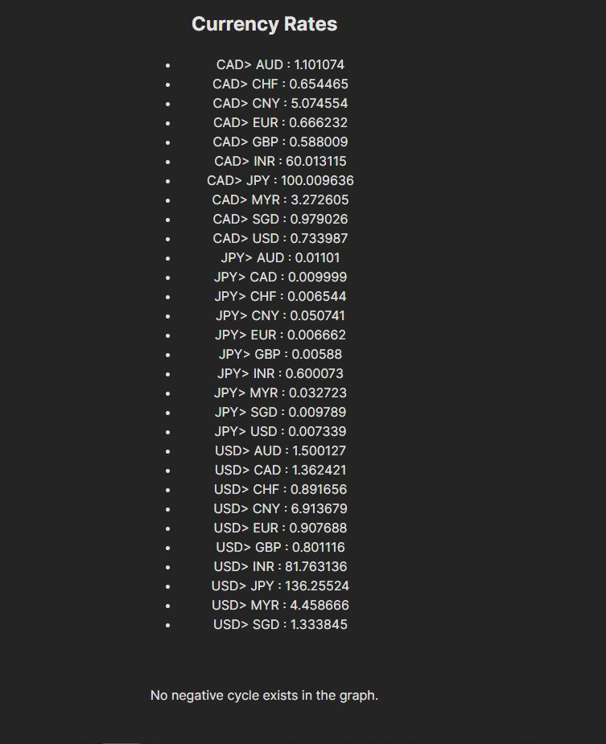

# ArbitrageDetector
This program web-scrapes exchange rates for currencies and runs a modification of the bellman-ford algorithm to detect for negative-weight cycles. The graph has currencies as its verticies, and the edge weight betwen two currencies is modifided to not be the actual exchange rate, but the inverse log of it. If there exists a negative weight cycle in the graph, then there exists an arbitrage opportunity!

### How it Works
- The backend is a Python Flask application that uses BeautifulSoup to scrape excahnge rates between currencies from the Web and creates an api route that relays this data.
- The frontend is a Typescript React application that runs the Arbitrage detection algorithm and displays results to the user. It actively updates results every 30seconds - utilizing the api created above.

### How does Bellman Ford detect for negative weight cycles?
- The Bellman Ford algorithm is a shortest path algorithm. As the algorithm is executed the Single Source Shortest path from a given source to all other vertices using at most k edges can be found out at each step. The algorithm loops through this value k from 0 all the way to n-1 edges. If The algorithm is run again with k = n edges and a shortest path distance is updated, then we know an a negative weight cycle exists. This is a high level explanation of how it works :). 

### Why do we need the negative inverse log of the exchange rates?
- The currency exchange rates would have to be dealth with in a multiplicative way. In fact an arbitrage exists if the w1 * w2 * w3 * … * wn > 1, where w is the exchange rates.
- Since this is difficult to deal with/identify in a graph we can create a additive property by taking the log on both sides of the equation log(w1) + log(w2) + log(w3) + … + log(wn) > 0.
- If we take the negative on both sides we get (-log(w1)) + (-log(w2)) + (-log(w3)) + … + (-log(wn)) < 0
- Henve if we find a negative weight cycle in the graph with transformed edges(negative log) then an arbitrage exists.
- Cool!


## Steps To Run

###  Backend

- Go to cool coolarbitrage folder
- run
```
python main.py
```
- This will create a Flask API running on localhost:5000

### Frontend
- Go to my-vite-app folder
- run
```
npm run dev
```

### Enjoy - the App.tsx file contains the bellman-ford logic to detect arbitrages



