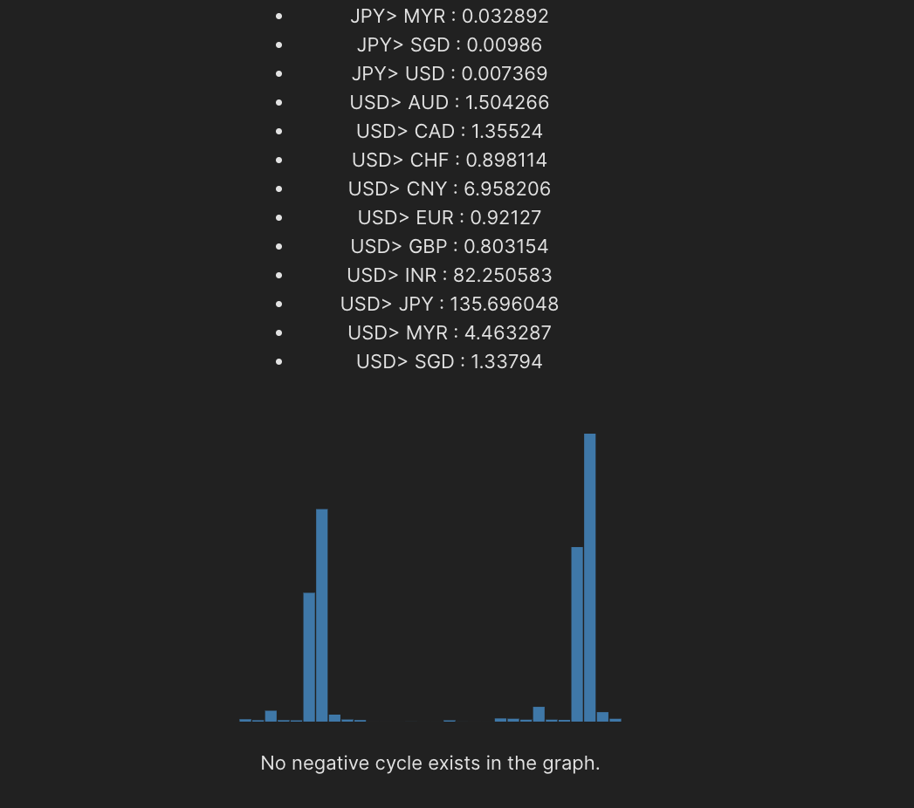

# ArbitrageDetector
This program web-scrapes exchange rates for currencies and runs a modification of the bellman-ford algorithm to detect for negative-weight cycles. The graph G has currencies as its verticies and the edge weight betwen two currencies is modifided to not be the actual exchange rate, but the inverse log of it.

## Steps To Run

###  Backend

- Go to cool coolarbitrage folder
- run
```
python main.py
```
- This will create a Flask API running on localhost:5000

### Frontend
- Go to my-vite-app folder
- run
```
npm run dev
```

### Enjoy - the App.tsx file contains the bellman-ford logic to detect arbitrages



